# Apply Sequence Diagrams

**Document type:** Frozen sequence specification  
**Version:** `aether.cp.apply.v1`  
**Date:** 2026-07-30  
**Related:** [APPLY_PROTOCOL_SPECIFICATION.md](APPLY_PROTOCOL_SPECIFICATION.md), [APPLY_STATE_MACHINE.md](APPLY_STATE_MACHINE.md), [APPLY_FAILURE_MODEL.md](APPLY_FAILURE_MODEL.md)

---

## 1. Participants

| Participant | Role |
|-------------|------|
| **Operator** | Human or automation with JWT |
| **Admin** | Operator with `admin` role (Apply approval) |
| **Control Plane (CP)** | API + validation + orchestration |
| **Signer** | `SigningGateway` — attests Apply payload |
| **Replay Store** | `signed_operation_replay` — one-shot guard |
| **PROTO-0** | Protocol authority — grant/revoke |
| **Audit** | `audit_log` + `mutation_audit` + `signer_audit` |

---

## 2. Normal execution (happy path)

### 2.1 Phase A — Dry-run (prerequisite)

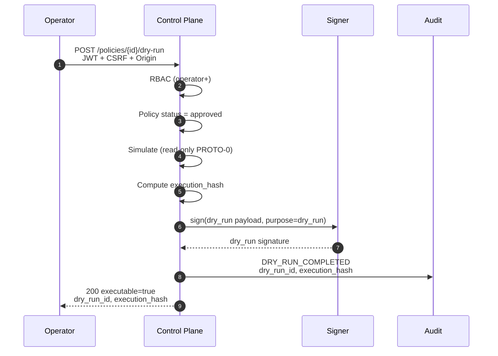

### 2.2 Phase B — Apply approval grant

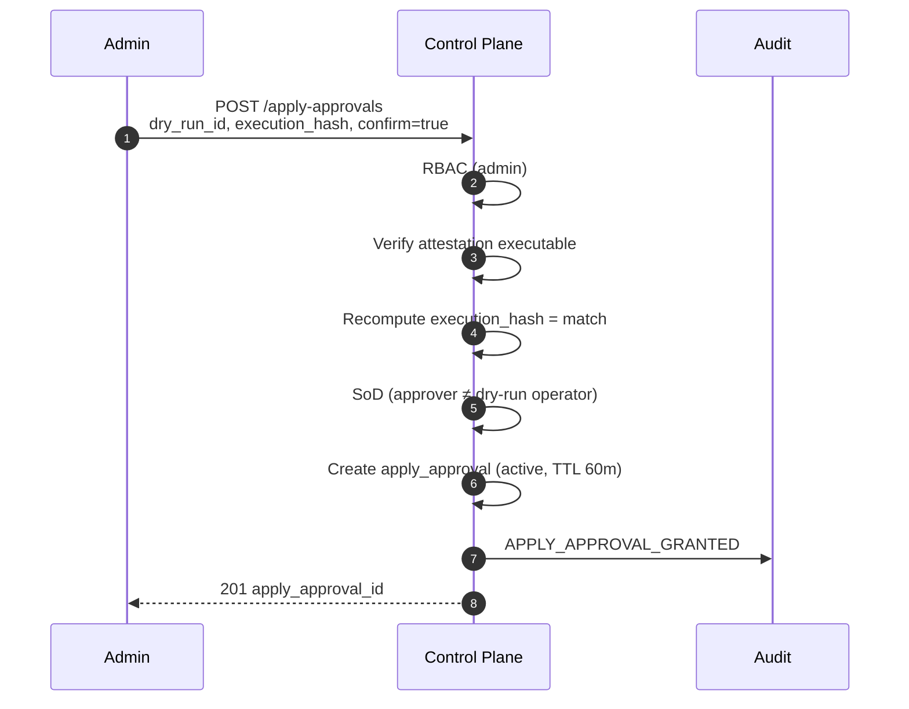

### 2.3 Phase C — Apply submit (mutation)

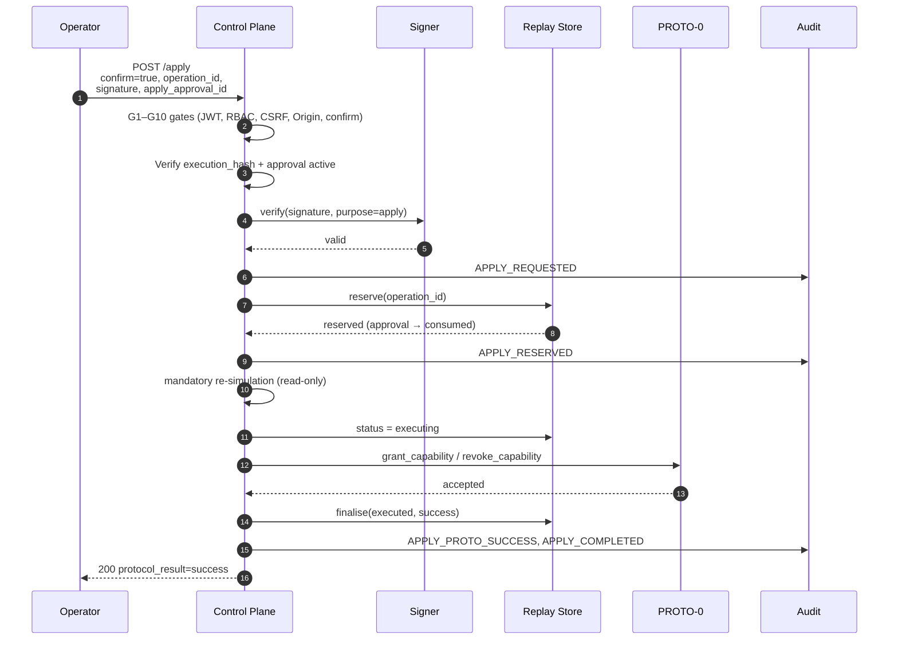

---

## 3. Replay attempt (duplicate operation_id)

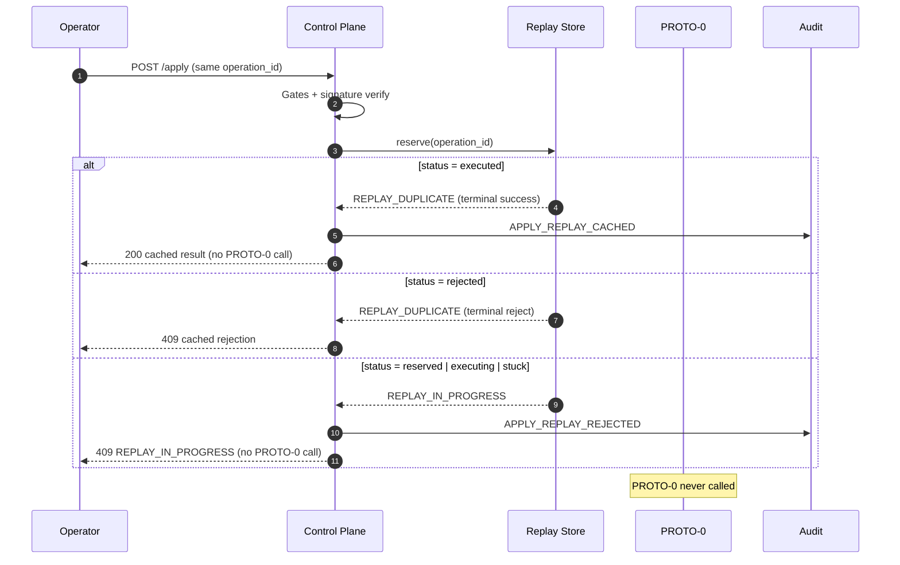

---

## 4. Expired approval

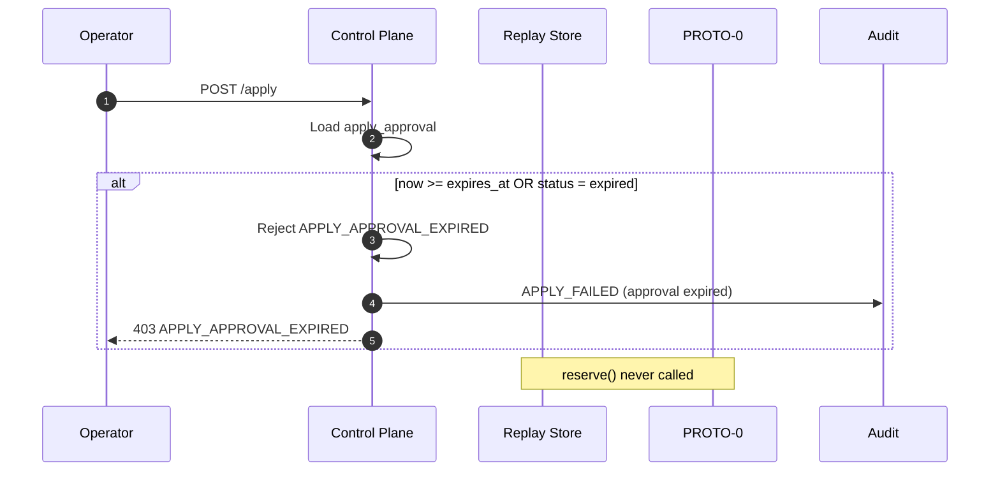

---

## 5. Expired signature

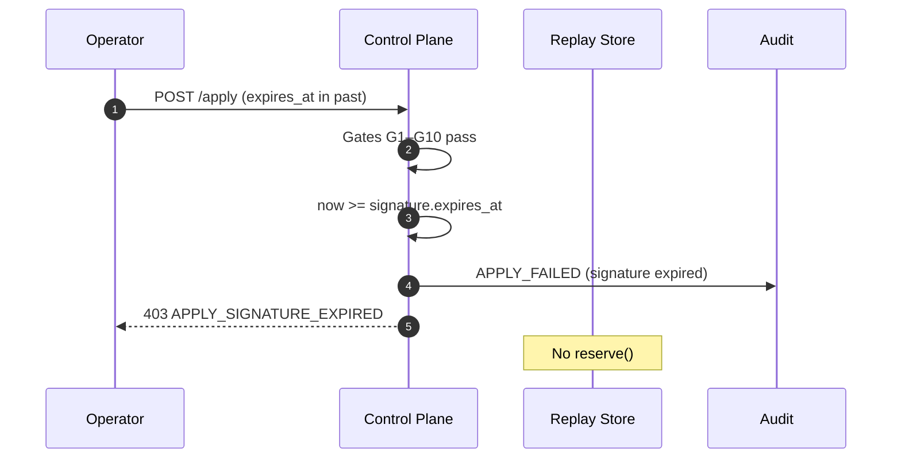

---

## 6. PROTO-0 rejection

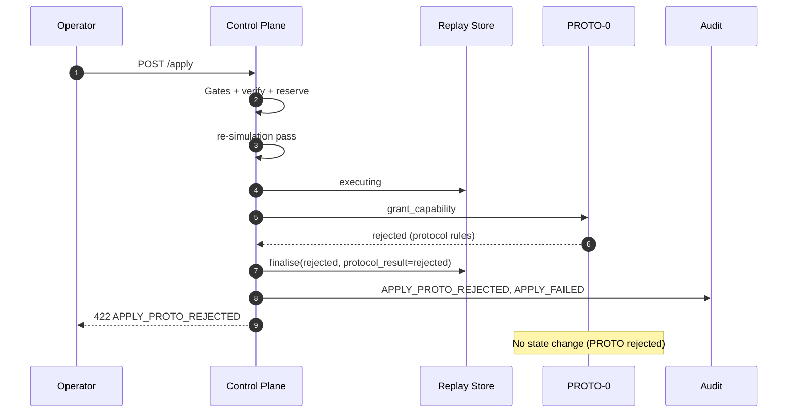

---

## 7. Re-simulation failure (stale protocol state)

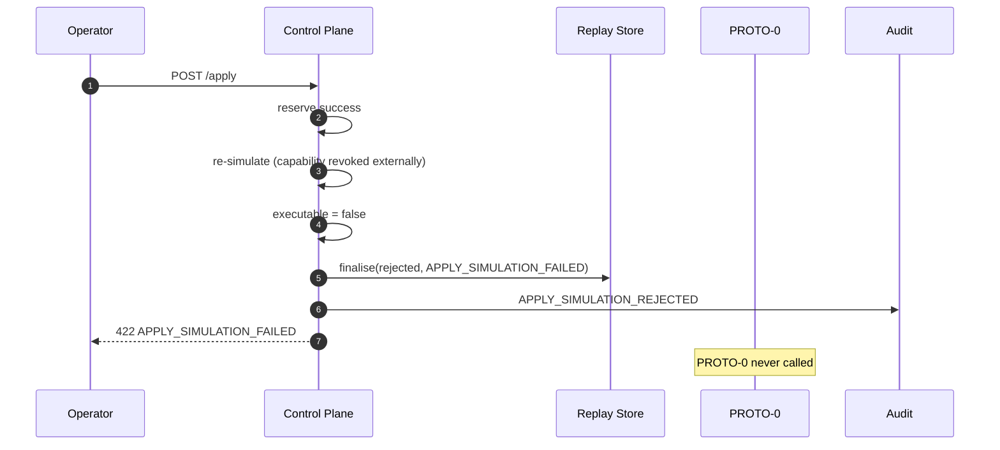

---

## 8. Network failure (timeout during PROTO-0)

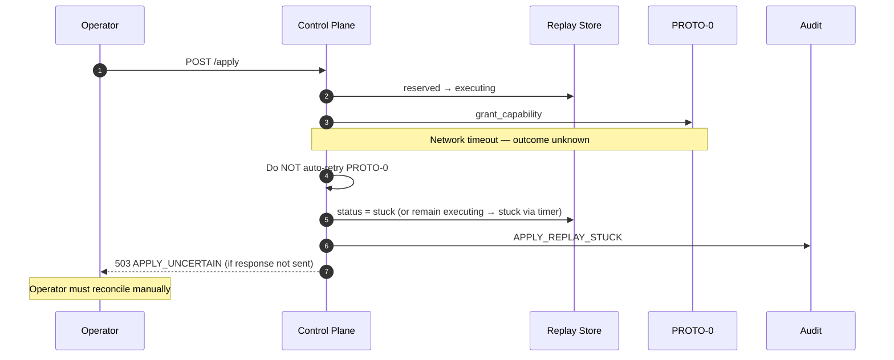

---

## 9. Crash recovery

### 9.1 Crash after reserve, before execute

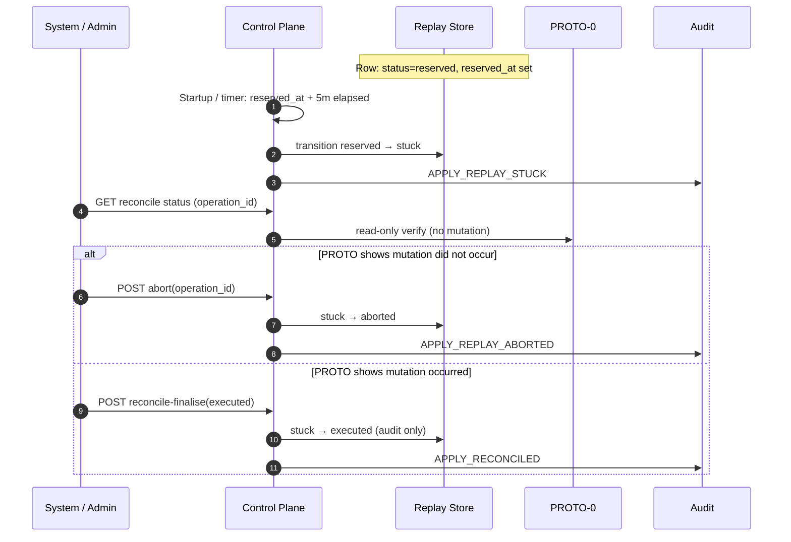

### 9.2 Crash after PROTO-0 success, before finalise

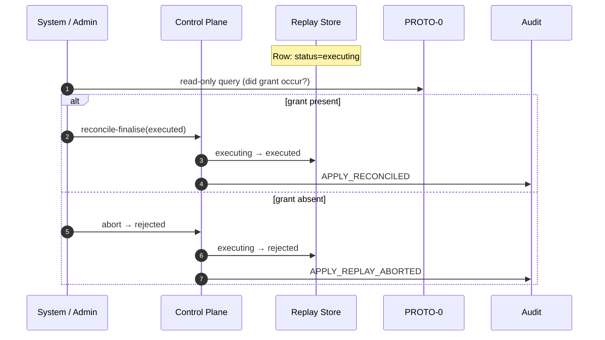

### 9.3 Crash before audit write

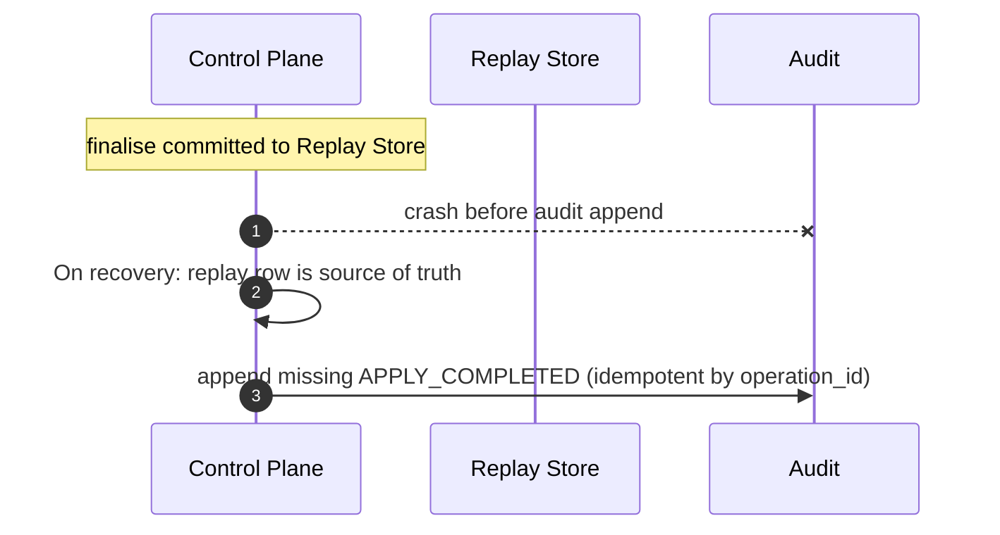

**Rule:** Replay store terminal state takes precedence; audit backfill is idempotent on `operation_id`.

---

## 10. Dry-run signature replay at Apply (forbidden)

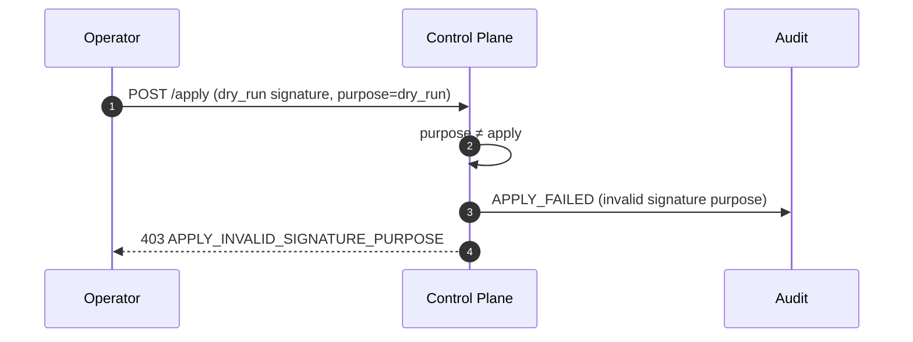

---

## 11. Stale policy / execution hash

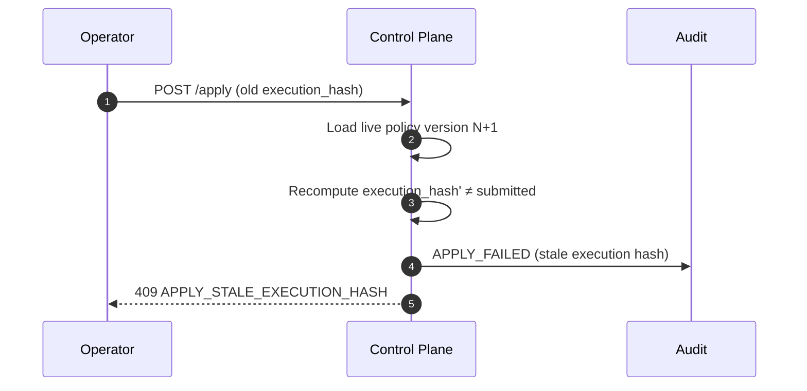

---

## 12. Message ordering invariants

1. **Audit** `APPLY_REQUESTED` after gate pass, before `reserve`.
2. **Replay** `reserve` before re-simulation and before PROTO-0.
3. **Re-simulation** after `reserve`, before `executing`.
4. **PROTO-0** at most once per `operation_id`.
5. **Finalise** always called after PROTO-0 returns or simulation fails post-reserve.
6. **Signer verify** before `reserve`.

---

## 13. Freeze statement

> Sequence ordering in this document is normative. Implementations must not reorder `reserve`, re-simulation, PROTO-0, and `finalise`.
