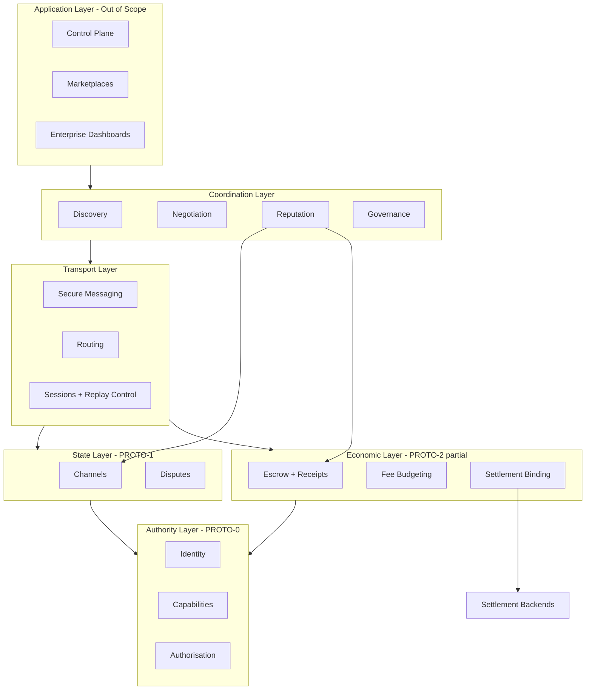

# MAINFRAME_ARCHITECTURE.md — Aether Protocol Stack

## Status

**Design document — not implementation specification**

Phase 2 mainframe map: the protocol operating system between Phase 1 primitives and future agent applications.

---

## 1. Executive Summary

Aether's mainframe is a **layered trust and coordination stack** for machine actors. Phase 1 implemented the bottom three protocol layers locally. Phase 2 defines what must be added above and around them before autonomous agents can coordinate economically at scale.

```text
┌─────────────────────────────────────────────────────────────┐
│  Application Layer (out of scope)                           │
│  Control Plane · Marketplaces · Enterprise dashboards       │
├─────────────────────────────────────────────────────────────┤
│  Coordination Layer (Phase 2+ design)                       │
│  Discovery · Negotiation · Reputation · Governance          │
├─────────────────────────────────────────────────────────────┤
│  Transport Layer (Phase 2+ design)                          │
│  Secure messaging · Routing · Replay prevention · Sync      │
├─────────────────────────────────────────────────────────────┤
│  Economic Layer (Phase 1 partial)                           │
│  Escrow · Receipts · Fees · Settlement binding              │
├─────────────────────────────────────────────────────────────┤
│  State Layer (Phase 1 complete — local)                     │
│  Bilateral channels · Commitment chains · Disputes          │
├─────────────────────────────────────────────────────────────┤
│  Authority Layer (Phase 1 complete — local)                 │
│  Identity · Capabilities · Permission roots · Authorisation │
└─────────────────────────────────────────────────────────────┘
```

---

## 2. Current State vs Future State

### Current (Phase 1 complete)

```text
Agent (local process)
  ↓
PROTO-0  Identity + Capability authority
  ↓
PROTO-1  Bilateral signed state (channels)
  ↓
PROTO-2  Escrow + receipt settlement (simulated)
```

All stores are in-memory. All parties share one trusted process. Logical time is harness-injected.

### Future (mainframe target)

```text
Autonomous agents (distributed)
  ↓
Discovery          — find counterparty agents and services
  ↓
Trust              — reputation, bonds, evidence history
  ↓
Negotiation        — terms, capabilities, settlement profile
  ↓
Execution          — channels, task work, attestations
  ↓
Settlement         — real value movement with finality stages
  ↓
Reputation         — evidence-backed score updates
  ↓
Coordination       — multi-agent workflows, governance
```

---

## 3. Layer-by-Layer Architecture

### Layer 1 — Agent Identity

**Current:** PROTO-0 (`AgentId`, `AgentIdentity`, permission root, operational key)

| Question | Phase 2 position |
|----------|------------------|
| Is `AgentId` sufficient? | **Sufficient for v0 local identity.** Insufficient alone for discovery, rotation, or multi-environment persistence. `AgentId` should remain the stable root; environment-specific handles are a separate concern. |
| How do agents discover each other? | **Not via `AgentId` alone.** Requires a discovery layer (directory, DHT, or curated registry). See DEC-P2-001. |
| Identity across environments? | **Binding model needed:** `AgentId` + `EnvironmentBindingV0` (host, region, runtime attestation optional). Same identity, multiple deployment contexts. |
| When is key rotation mandatory? | **Before networked deployment** for operational keys; **before production economic volume** for root/recovery hierarchy. Mid-session rotation is a Phase 2+ protocol extension. |

**Missing primitives:**

- `KeyRotationV0` — operational key successor chain with grace period
- `EnvironmentBindingV0` — tie identity to deployment context without changing `AgentId`
- `IdentityDocumentV0` — portable self-describing identity bundle for discovery handoff

---

### Layer 2 — Capability Infrastructure

**Current:** `CapabilityV0`, `CapabilityGrant`, `CapabilityStore`, expiry + revoke + delegation depth

| Question | Phase 2 position |
|----------|------------------|
| Issuance at scale? | Local grant/sign works. At scale: issuer registry, batch issuance, template profiles. |
| Discovery? | Capabilities are **presented**, not discovered. Counterparty verifies grant against issuer trust, not a global capability directory. |
| Delegated permissions? | PROTO-0 narrowing works locally. Distributed delegation requires **revocation propagation** and **stale-grant rejection** across peers. |
| Hierarchical storage? | **Yes, eventually.** Merkle permission roots become necessary when: (a) grant volume exceeds linear verification, (b) light clients need inclusion proofs, (c) auditors need historical root snapshots. |
| When Merkle roots? | **Before public multi-issuer capability federation.** Not required for single-tenant enterprise pilot. See DEC-P2-005. |

**Missing primitives:**

- `CapabilityRevocationListV0` or accumulator-based revoke broadcast
- `CapabilityProfileV0` — reusable action templates for enterprise policy
- `PermissionRootMerkleV0` — scalable root commitment (extends Phase 0 provisional root)
- `RevocationSyncV0` — gossip or registry protocol for cross-peer revoke freshness

---

### Layer 3 — Agent Communication

**Current:** None. All interaction is in-process function calls.

| Research area | Design direction |
|---------------|------------------|
| Agent discovery | Directory service vs DHT vs curated marketplace index. Start curated for enterprise; open DHT deferred. |
| Secure messaging | Encrypted transport + signed protocol envelopes (reuse DEC-004B). |
| Protocol negotiation | Version/capability handshake before economic ops. `ProtocolHelloV0`. |
| Message routing | Direct peer, relay, or hub-and-spoke. Hub likely for enterprise; mesh for open network. |
| Replay prevention | Nonce + session binding + logical sequence per peer relationship. |
| Offline delivery | Store-and-forward with signed message expiry; not in v0 network design. |

**Missing primitives:**

- `AgentDirectoryV0` — registration, lookup, capability advertisement (metadata only)
- `ProtocolHelloV0` — version, supported protos, identity, capability summary
- `SecureSessionV0` — session keys, nonces, replay window
- `MessageEnvelopeV0` — transport wrapper around existing `SignedMessage`
- `DeliveryReceiptV0` — optional ack for critical economic messages

**Constraint:** Design only. No sockets, no libp2p, no implementation in this gate.

---

### Layer 4 — Reputation / Trust

**Current:** None. PROTO-3 planned as reputation indexer prototype.

| Research area | Design direction |
|---------------|------------------|
| Building reputation | Evidence-backed events only: completed escrows, dispute outcomes, bond slashes. No self-reported scores. |
| Verified history | Indexers derive scores from signed protocol events; canonical events defined in schema. |
| Evidence-based trust | Trust queries return `{score, evidence_refs, freshness}` — not opaque ratings. |
| Sybil resistance | Bonds + rate limits + stake-weighted history; no reputation without economic cost. |
| Portability | Scores tied to `AgentId`; indexers compete on derivation, not identity silos. |

**Missing primitives:**

- `ReputationEventV0` — canonical signed event types (escrow terminal, dispute, slash)
- `ReputationQueryV0` — standard query interface
- `BondV0` — lockable stake for identity registration, disputes, high-value tasks
- `SybilPolicyV0` — minimum bond / rate limit parameters per task class

**Prototype candidate:** PROTO-3 Reputation Indexer (after architecture gate).

---

### Layer 5 — Settlement Architecture

**Current:** PROTO-2 simulated `BalanceLedger`; `hard_settlement_placeholder` always false.

| Model | Role in Aether |
|-------|----------------|
| Traditional payment rails | Enterprise pilot path; fiat custody via licensed partner |
| Custodial systems | Short-term bridge; agent keys authorise, custodian holds |
| Blockchain settlement | Optional backend; provides hard finality stage |
| Stablecoin settlement | Likely crypto pilot path; lower volatility than native assets |
| Enterprise ledger | Internal accounting for spend-controlled agent fleets |

**Design principle (from CONSENSUS_AND_SETTLEMENT.md):** Settlement-agnostic protocol. `AgentId` is root; backends bind via `SettlementBindingV0`.

**Missing primitives:**

- `SettlementBindingV0` — link `AgentId` to backend account/address
- `FinalityStageV0` — PROPOSED → ACCEPTED → SETTLEMENT_FINAL → DISPUTE_WINDOW_FINAL → ECONOMIC_FINAL
- `SettlementAdapter` trait — pluggable backend interface (design only)
- `InclusionProofV0` — light-client verification of settlement inclusion

**Constraint:** Do not choose backend in Phase 2 architecture gate. Research and decision record only (DEC-P2-003).

**Prototype candidate:** PROTO-4 Settlement Backend Spike (after architecture gate + backend shortlist).

---

### Layer 6 — Governance

**Current:** `protocol_version` / `schema_version` fields in all v0 objects. No negotiation or upgrade path.

| Research area | Design direction |
|---------------|------------------|
| Protocol upgrades | Explicit version negotiation; no silent schema drift |
| Schema evolution | Additive fields only in minor versions; breaking changes require new major |
| Version negotiation | `ProtocolHelloV0` + capability intersection |
| Backwards compatibility | N-1 version support window for networked phase |
| Security reviews | Required gate before each proto graduation |

**Missing primitives:**

- `SchemaRegistryV0` — canonical schema hashes per version
- `UpgradeProposalV0` — governance artifact (parameters, not token voting in v0)
- `CompatibilityMatrix` — which proto versions interoperate

---

## 4. Mainframe Architecture Map



---

## 5. Missing Primitive List

| ID | Primitive | Layer | Priority | Blocked by |
|----|-----------|-------|----------|------------|
| MP-01 | `ProtocolHelloV0` | Transport | P0 | — |
| MP-02 | `SecureSessionV0` | Transport | P0 | MP-01 |
| MP-03 | `MessageEnvelopeV0` | Transport | P0 | MP-02 |
| MP-04 | `AgentDirectoryV0` | Coordination | P0 | DEC-P2-001 |
| MP-05 | `RevocationSyncV0` | Authority | P0 | DEC-P2-002 |
| MP-06 | `KeyRotationV0` | Authority | P1 | — |
| MP-07 | `SettlementBindingV0` | Economic | P0 | DEC-P2-003 |
| MP-08 | `FinalityStageV0` | Economic | P0 | DEC-P2-003 |
| MP-09 | `BondV0` | Economic | P1 | DEC-P2-003 |
| MP-10 | `ReputationEventV0` | Coordination | P1 | PROTO-3 |
| MP-11 | `PermissionRootMerkleV0` | Authority | P2 | DEC-P2-005 |
| MP-12 | `EnvironmentBindingV0` | Authority | P2 | — |
| MP-13 | `SchemaRegistryV0` | Governance | P1 | — |
| MP-14 | `NegotiationTermsV0` | Coordination | P1 | MP-04 |

**P0** = required before any networked pilot  
**P1** = required before open multi-party economy  
**P2** = required at scale / federation

---

## 6. Dependency Graph

```text
PROTO-0 (identity, capabilities)
    │
    ├──► PROTO-1 (channels) ──► PROTO-2 (escrow)
    │                              │
    │                              ▼
    │                         SettlementBindingV0 ──► Settlement Backend
    │
    ├──► RevocationSyncV0 ──► SecureSessionV0 ──► MessageEnvelopeV0
    │                              │
    │                              ▼
    └──► AgentDirectoryV0 ──► ProtocolHelloV0 ──► NegotiationTermsV0
                                       │
                                       ▼
                              ReputationEventV0 ◄── PROTO-2/1 terminal events
                                       │
                                       ▼
                                  BondV0 / SybilPolicyV0
```

**Critical path for first networked pilot:**

```text
PROTO-0/1/2 (done)
  → DEC-P2-001 (discovery model)
  → DEC-P2-002 (network trust model)
  → DEC-P2-003 (settlement philosophy)
  → MP-01..05, MP-07..08 (network + settlement binding design)
  → PROTO-4 spike (one backend)
  → networked integration prototype
```

Reputation (PROTO-3) and Merkle permissions (MP-11) are parallel tracks, not on the critical path for a minimal pilot.

---

## 7. Phase 2 Roadmap

### Stage A — Architecture Gate (current)

| Step | Deliverable | Status |
|------|-------------|--------|
| A1 | Phase 2 context + scope | This document set |
| A2 | Mainframe map + missing primitives | This document |
| A3 | Decision records for open questions | ARCHITECTURE_DECISIONS.md |
| A4 | Expanded threat model | MAINFRAME_THREAT_MODEL.md |
| A5 | Business alignment analysis | BUSINESS_ALIGNMENT.md |
| A6 | Architecture review + first prototype selection | Pending review |

### Stage B — Network Foundation (post-gate, design → proto)

| Step | Focus | Prototype |
|------|-------|-----------|
| B1 | Transport + session design freeze | PROTO-NET-0 (TBD) |
| B2 | Discovery + hello handshake | PROTO-NET-1 (TBD) |
| B3 | Revocation sync across peers | Extends PROTO-0 |
| B4 | Networked PROTO-1 channel sync | Extends PROTO-1 |

### Stage C — Economic Reality (post-gate)

| Step | Focus | Prototype |
|------|-------|-----------|
| C1 | Settlement backend shortlist + spike | PROTO-4 |
| C2 | Settlement binding + finality stages | Extends PROTO-2 |
| C3 | Bond lock/slash design | New primitive |
| C4 | End-to-end hire→settle on test backend | Integration proto |

### Stage D — Trust Layer (parallel / follow-on)

| Step | Focus | Prototype |
|------|-------|-----------|
| D1 | Reputation event schema + indexer | PROTO-3 |
| D2 | Sybil policy + bond integration | Extends PROTO-3 |
| D3 | Adversarial reputation tests | PROTO-3 acceptance |

---

## 8. Prototype Candidates (Post Architecture Review)

| Candidate | Exercises | Prerequisites | Recommended order |
|-----------|-----------|---------------|-------------------|
| **PROTO-NET-0** | Secure session + signed message transport (loopback or local TCP) | Architecture gate, DEC-P2-002 | **1st** — unblocks everything |
| **PROTO-4** | Settlement backend spike (one adapter) | DEC-P2-003, MP-07/08 design | **2nd** — unblocks real economic ops |
| **Networked PROTO-1** | Channel state sync between two processes | PROTO-NET-0 | 3rd |
| **Networked PROTO-2** | Escrow across two agents + settlement binding | PROTO-NET-0, PROTO-4 | 4th |
| **PROTO-3** | Reputation indexer from terminal events | Networked PROTO-2 events | 5th |
| **PROTO-5** | Selective disclosure credentials | Reputation thresholds defined | Stretch |

**Recommended first prototype after gate:** PROTO-NET-0 (transport + session) **or** PROTO-4 (settlement spike) depending on business wedge — see [BUSINESS_ALIGNMENT.md](BUSINESS_ALIGNMENT.md).

- **Enterprise wedge** → PROTO-4 first (spend control needs real ledger binding)
- **Open agent marketplace wedge** → PROTO-NET-0 first (agents must find and talk to each other)

---

## 9. Integration: Phase 1 → Mainframe

Phase 1 modules remain the **canonical rule engines**. The mainframe wraps them; it does not rewrite them.

| Phase 1 module | Mainframe role |
|----------------|----------------|
| `authorise_action` | Called on every inbound network message before domain logic |
| `ChannelStore` / transitions | Becomes replicated state; local store becomes one replica |
| `EscrowStore` / transitions | Same; settlement binding adds hard finality stage |
| `SignedMessage` / DEC-004B | Becomes payload inside `MessageEnvelopeV0` |
| `EconomicFinalityViewV0` | Gains `SETTLEMENT_FINAL` stage from backend adapter |

**Rule:** No weakening of Phase 1 security remediations during networking integration.

---

## 10. Open Questions (→ ARCHITECTURE_DECISIONS.md)

- DEC-P2-001: Agent discovery mechanism
- DEC-P2-002: Network trust model
- DEC-P2-003: Settlement philosophy
- DEC-P2-004: Reputation architecture
- DEC-P2-005: Permission scaling model
- DEC-P2-006: First networked prototype selection
- DEC-P2-007: Hub vs mesh topology default

---

## Freeze Statement

> This document defines the mainframe architecture map for review. It does not authorise implementation, networking code, tokens, or settlement deployment.

Changes require update to this file and affected decision records with recorded rationale.
